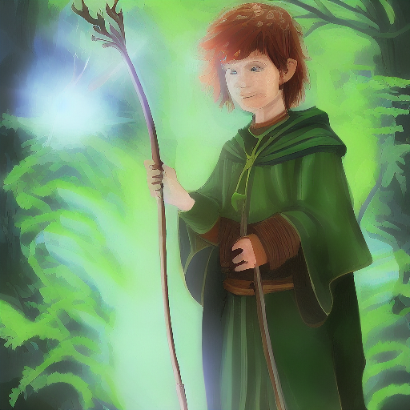

# Diffusion Engine

A from-scratch implementation of DDPM (Denoising Diffusion Probabilistic Models) sampling for Stable Diffusion, built for learning and experimentation.



## Overview

This project implements the core mathematics of diffusion models as described in [Ho et al. (2020)](https://arxiv.org/abs/2006.11239), rather than relying on high-level library abstractions. The sampling loop manually computes each reverse diffusion step, making the underlying math explicit and hackable.

**Key features:**

- Manual DDPM reverse process implementation
- Classifier-Free Guidance (CFG) sampling
- Separation between math (`diffusion.py`) and orchestration (`sampler.py`)
- Support for CUDA, MPS (Apple Silicon), and CPU

## Architecture

```
┌─────────────────────────────────────────────────────────┐
│                         main.py                         │
│                      (CLI interface)                    │
└─────────────────────────────────────────────────────────┘
                              │
                              ▼
┌─────────────────────────────────────────────────────────┐
│                        sampler.py                       │
│              (CFG sampling loop orchestration)          │
│                                                         │
│  ┌─────────────┐    ┌─────────────┐    ┌─────────────┐  │
│  │ encode      │    │ UNet        │    │ decode      │  │
│  │ prompt      │───▶│ forward x2  │───▶│ latents     │  │
│  └─────────────┘    └─────────────┘    └─────────────┘  │
│                            │                            │
│                            ▼                            │
│                   ┌─────────────────┐                   │
│                   │  DiffusionCore  │◀── diffusion.py   │
│                   │   .ddpm_step()  │    (the math)     │
│                   └─────────────────┘                   │
└─────────────────────────────────────────────────────────┘
                             │
                             ▼
┌─────────────────────────────────────────────────────────┐
│                         model.py                        │
│                    (pipeline loading)                   │
└─────────────────────────────────────────────────────────┘
```

## The Math

The core diffusion operations in `diffusion.py`:

**Forward process** (adding noise):
```
x_t = √ᾱ_t · x_0 + √(1-ᾱ_t) · ε,   where ε ~ N(0, I)
```

**Reverse step** (denoising):
```
x_{t-1} = (√ᾱ_{t-1} · β_t / (1-ᾱ_t)) · x̂_0 + (√α_t · (1-ᾱ_{t-1}) / (1-ᾱ_t)) · x_t + σ_t · z
```

**Predicting x_0 from noise**:
```
x̂_0 = (x_t - √(1-ᾱ_t) · ε_θ) / √ᾱ_t
```

Where:
- `ᾱ_t` = cumulative product of (1 - β) up to step t
- `ε_θ` = noise predicted by the UNet
- `x̂_0` = predicted clean image

## Installation

```bash
git clone https://github.com/minchoi1124/diffusion-engine.git
cd diffusion-engine
python -m venv .venv
source .venv/bin/activate  # On Windows: .venv\Scripts\activate
pip install -r requirements.txt
```

**Note:** First run will download the Stable Diffusion v1.4 weights.

## Usage

Basic generation:

```bash
python -m src --prompt "Young wizard holding a glowing staff in the forest in a fantasy style"
```

With options:

```bash
python -m src \
    --prompt "Young wizard holding a glowing staff in the forest in a fantasy style" \
    --negative-prompt "blurry, low quality" \
    --steps 50 \
    --guidance 8.0 \
    --seed 42 \
    --out outputs/wizard.png
```

### CLI Arguments

| Argument | Default | Description |
|----------|---------|-------------|
| `--prompt` | (required) | Text description of the image |
| `--negative-prompt` | `""` | What to avoid in the image |
| `--steps` | `50` | Number of denoising steps |
| `--guidance` | `8.0` | CFG scale (higher = closer to prompt) |
| `--seed` | `42` | Random seed for reproducibility |
| `--height` | `512` | Output height in pixels |
| `--width` | `512` | Output width in pixels |
| `--out` | `outputs/generated.png` | Output file path |

## Project Structure

```
diffusion-engine/
├── src/
│   ├── __main__.py    # Package entrypoint
│   ├── main.py        # CLI and orchestration
│   ├── config.py      # Hyperparameters and settings
│   ├── model.py       # Pipeline loading
│   ├── sampler.py     # CFG sampling loop
│   └── diffusion.py   # Core DDPM math
├── requirements.txt
└── README.md
```

## References

- [Denoising Diffusion Probabilistic Models](https://arxiv.org/abs/2006.11239) (Ho et al., 2020)
- [Classifier-Free Diffusion Guidance](https://arxiv.org/abs/2207.12598) (Ho & Salimans, 2022)
- [High-Resolution Image Synthesis with Latent Diffusion Models](https://arxiv.org/abs/2112.10752) (Rombach et al., 2022)

## License

MIT

